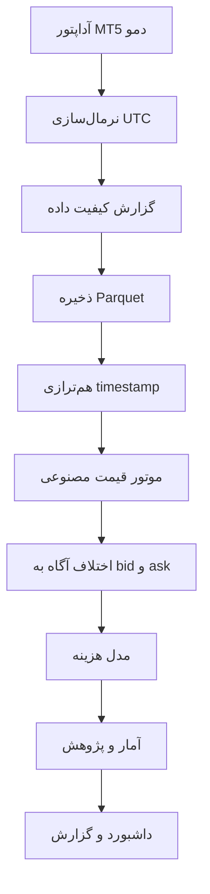

# جریان داده

1. زمان MT5 به UTC دارای timezone تبدیل می‌شود.
2. quote شامل broker، source، bid و ask باقی می‌ماند.
3. گزارش کیفیت، داده تکراری و quote نامعتبر را بدون repair خودکار ثبت می‌کند.
4. هم‌ترازی، تأخیر را ثبت و داده خارج از tolerance را کنار می‌گذارد.
5. ارزیابی فرمول، قیمت نظری و بازه اجرایی مصنوعی می‌دهد.
6. تحلیل هزینه، مقدار ناخالص و خالص را جدا نگه می‌دارد.
7. خروجی پژوهشی نامزد محسوب می‌شود و باید provenance داشته باشد.

هیچ مرحله‌ای سفارش ثبت نمی‌کند.
