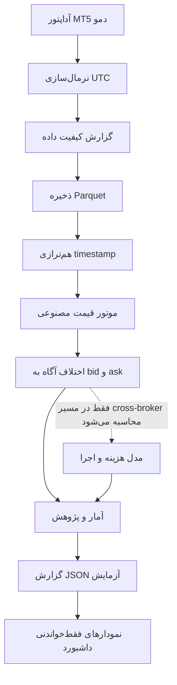

# جریان داده

```mermaid
flowchart TD
    MT5[آداپتور MT5 دمو] --> Normalize[نرمال‌سازی UTC]
    Normalize --> Quality[گزارش کیفیت داده]
    Quality --> Storage[ذخیره Parquet]
    Storage --> Align[هم‌ترازی timestamp]
    Align --> Synthetic[موتور قیمت مصنوعی]
    Synthetic --> Discrepancy[اختلاف آگاه به bid و ask]
    Discrepancy --> Research[آمار و پژوهش]
    Discrepancy -.فقط در مسیر cross-broker محاسبه می‌شود.-> Costs[مدل هزینه و اجرا]
    Costs --> Research
    Research --> Report[گزارش JSON آزمایش]
    Report --> Dashboard[نمودارهای فقط‌خواندنی داشبورد]
```

1. زمان MT5 به UTC دارای timezone تبدیل می‌شود.
2. quote شامل broker، source، bid و ask باقی می‌ماند.
3. گزارش کیفیت، داده تکراری و quote نامعتبر را بدون repair خودکار ثبت می‌کند.
4. هم‌ترازی، تأخیر را ثبت و داده خارج از tolerance را کنار می‌گذارد.
5. ارزیابی فرمول، قیمت نظری و بازه اجرایی مصنوعی می‌دهد.
6. هزینه، سازگاری قرارداد، funding، latency و امکان‌پذیری پرشدن در مسیر cross-broker محاسبه می‌شوند، جایی که لبه خالص به دست می‌آید. مسیر تک‌نمادی در اختلاف متوقف می‌شود و هیچ لبه اجرایی ادعا نمی‌کند، پس عمداً هیچ مدل هزینه‌ای اعمال نمی‌کند.
7. خروجی پژوهشی نامزد محسوب می‌شود و باید provenance داشته باشد.
8. داشبورد previewهای ذخیره‌شده `EXP-*.json` را می‌خواند و سفارش ثبت نمی‌کند.
