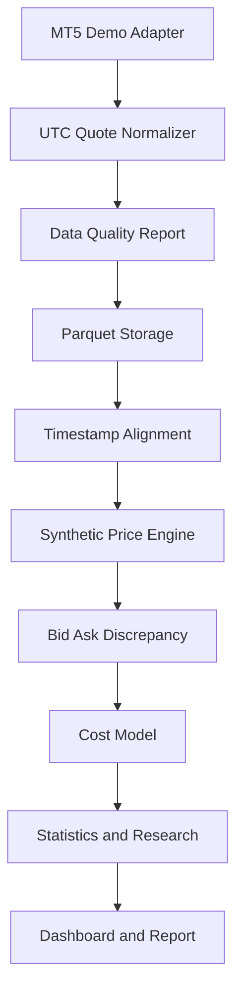

# Data Flow

1. MT5 timestamps are converted to timezone-aware UTC values.
2. Quotes retain broker, source, bid, and ask.
3. Data quality reports identify duplicates and invalid quotes without silently repairing them.
4. Alignment records delay and rejects observations outside configured tolerance.
5. Formula evaluation returns theoretical and executable synthetic intervals.
6. Cost analysis preserves gross and net values separately.
7. Research output must be labeled as a candidate and include provenance.

No path in this flow writes an order.
