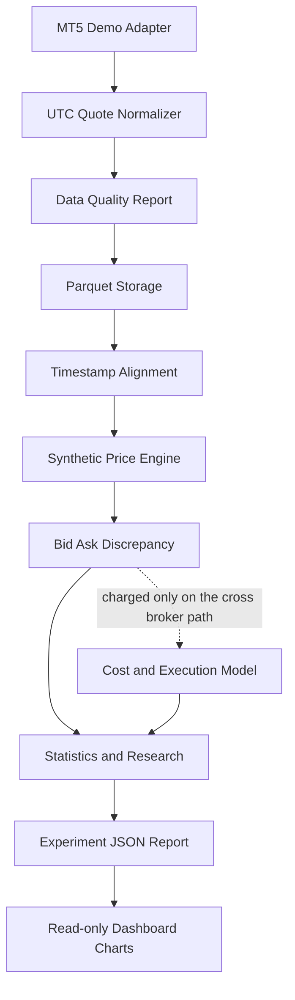

# Data Flow

```mermaid
flowchart TD
    MT5[MT5 Demo Adapter] --> Normalize[UTC Quote Normalizer]
    Normalize --> Quality[Data Quality Report]
    Quality --> Storage[Parquet Storage]
    Storage --> Align[Timestamp Alignment]
    Align --> Synthetic[Synthetic Price Engine]
    Synthetic --> Discrepancy[Bid Ask Discrepancy]
    Discrepancy --> Research[Statistics and Research]
    Discrepancy -.charged only on the cross broker path.-> Costs[Cost and Execution Model]
    Costs --> Research
     Research --> Report[Experiment JSON Report]
     Report --> Dashboard[Read-only Dashboard Charts]
```

1. MT5 timestamps are converted to timezone-aware UTC values.
2. Quotes retain broker, source, bid, and ask.
3. Data quality reports identify duplicates and invalid quotes without silently repairing them.
4. Alignment records delay and rejects observations outside configured tolerance.
5. Formula evaluation returns theoretical and executable synthetic intervals.
6. Costs, contract compatibility, funding, latency, and fill feasibility are charged on the cross-broker path, where a net edge is computed. The single-symbol path stops at a discrepancy and claims no executable edge, so it deliberately applies no cost model.
7. Research output must be labeled as a candidate and include provenance.
8. The dashboard reads persisted `EXP-*.json` previews and never writes an order.
